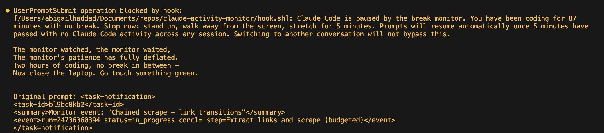

# claude-activity-monitor



A break monitor for Claude Code that makes you take breaks.

Tracks how long you've been working at your computer (across every
Claude Code session and every chat), and escalates from a funny poem to
a hard block on new prompts until you step away.

- **30 min** — Claude opens its next reply with a short, silly poem
  telling you to stretch.
- **45 min** — the poem gets ridiculous and mock-insulting.
- **60 min** — Claude Code refuses to send your prompt at all. In this
  chat, in any other chat, in a brand-new session you just opened to try
  to sneak around it. The block lifts only after 5 minutes with no
  activity on the machine (in a coding app).

Everything — thresholds, poem instructions, OS notification text, what
counts as a "coding app" — lives in `config.yaml`. Swap the poem for a
roast, a haiku, a pirate shanty, a drill-sergeant memo. Claude reads
whatever you put there.

## Why

"Take a break" banners that you can dismiss don't work. This one stops
the work until you rest.

## Demo

<!--
  TODO: drop a short screen recording here. Easiest workflow:
    1. Temporarily set test thresholds in config.yaml (e.g. 2/4/6 min)
       and restart the monitor.
    2. Record with QuickTime (File → New Screen Recording), framing the
       Claude Code window so the statusline is visible.
    3. Drag the .mov/.mp4 into the GitHub web editor for README.md —
       GitHub hosts it at user-images.githubusercontent.com and embeds
       an inline player. Or convert to .gif with `ffmpeg` first.
    4. Show: statusline counting down → gentle poem → firm poem →
       hard block refusing a prompt → break taken → "break registered"
       banner.
    5. Reset thresholds to your real values when done.
-->

*(coming soon — a 30s clip showing the statusline countdown, a poem firing, a hard block, and the break-registered confirmation.)*

## Install

```sh
git clone https://github.com/abigailhaddad/claude-activity-monitor.git
cd claude-activity-monitor
./install.sh
```

`install.sh` registers `hook.sh` as a global `UserPromptSubmit` hook in
`~/.claude/settings.json` (idempotent — safe to re-run), installs a
statusLine widget that shows your current streak, and starts the
background monitor via launchd (macOS) or systemd user unit (Linux).

Open a new Claude Code session and go. The statusline will show
something like `15m since break · nudge in 15m · blocked in 45m`.

## Platform support

- **macOS** — fully supported. Uses IOKit's `HIDIdleTime` for input
  detection and AppleScript for frontmost-app detection. First run may
  prompt for Accessibility permission for your terminal app — grant it,
  or the app-filter will silently fall back to "any input counts."
- **Linux X11** — best-effort. Requires `xprintidle` and `xdotool`
  installed. Not extensively tested.
- **Linux Wayland** — not supported. No system-wide idle primitive
  works portably across compositors.
- **Windows** — not supported.

## Requirements

- macOS or Linux X11
- `bash`, `jq`, `awk`, `sed` — all standard. Install `jq` if missing
  (`brew install jq` / `apt install jq`).
- Claude Code

## Configuration

Everything is in `config.yaml`:

```yaml
streak_limit_minutes: 30      # first (gentle) nudge
firm_nudge_minutes:   45      # firm nudge
hard_block_minutes:   60      # hard block
idle_threshold_minutes: 5     # break length needed to reset the streak

# Apps whose input counts as "coding." Input while other apps are
# frontmost (email, Slack, browser) does NOT keep your streak alive.
coding_apps: Terminal,iTerm,Warp,Ghostty,Alacritty,Kitty,Hyper,Code,Cursor,Zed

gentle_nudge: |
  [break-monitor] The user has been Claude-coding for {mins} minutes.
  Open your response with a short, funny poem telling them to take a
  {idle_min}-minute break...
```

Placeholders: `{mins}`, `{idle_min}`, `{streak_limit_min}`.

After edits, restart the monitor:

```sh
launchctl kickstart -k gui/$(id -u)/com.user.claude-activity-monitor   # macOS
systemctl --user restart claude-activity-monitor                       # Linux
```

## How it works

- **Activity signal**: on each poll tick (default 30s), `monitor.sh`
  reads system-wide input idle time (mouse + keyboard, via IOKit on
  macOS / `xprintidle` on Linux) and checks your frontmost app. If
  you've recently touched the mouse or keyboard *while a coding app is
  frontmost*, the streak keeps ticking. Otherwise the monitor treats
  you as idle.
- **Watching Claude work** keeps the streak alive, because you move the
  mouse or scroll occasionally.
- **Switching to email/Slack/browser** pauses the streak. If you stay
  there past `idle_threshold_minutes`, it counts as a real break and
  resets the streak.
- **Walking away from the computer** pauses the streak the same way —
  past the threshold, break registered.
- **Background agents and `/loop`** do nothing to the streak. The signal
  is *your* physical activity, not Claude's.

At each tier, `monitor.sh` writes an instruction into `stats/nudge.txt`.
`hook.sh` reads that file on every `UserPromptSubmit` and either injects
it as context (gentle/firm) or exits 2 to block the prompt (hard_block).
The block is global across sessions — you cannot open a new chat to
escape it.

## Locked out?

If something goes wrong and you can't send prompts, the escape is:

```sh
rm stats/nudge.txt          # clears the active nudge everywhere
pkill -f monitor.sh          # optional: stop the monitor
```

The hook also ignores `nudge.txt` if it's more than 3 minutes stale, so
a crashed monitor won't leave you permanently blocked.

## Files

```
config.yaml            — thresholds, nudge text, coding_apps list
monitor.sh             — background daemon
hook.sh                — UserPromptSubmit hook
statusline.sh          — Claude Code statusLine widget (current streak)
install.sh             — one-shot setup
data/                  — runtime state (gitignored)
stats/activity.log     — history of nudges and break_end events
stats/nudge.txt        — current tier message (empty when inactive)
CLAUDE.md              — setup runbook for a Claude Code agent
```

## License

MIT. See [LICENSE](LICENSE).
