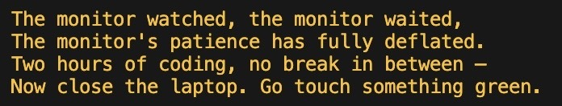
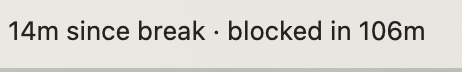

# claude-activity-monitor

[](https://github.com/abigailhaddad/claude-activity-monitor/actions/workflows/tests.yml)

> macOS only. The live menubar countdown is a SwiftBar plugin, and
> SwiftBar is a Mac app. The core bash scripts would run on
> Linux/Windows, but without the menubar readout we don't support
> those platforms.



Makes Claude Code refuse your prompts after you've been at it too
long. It counts how long you've been prompting Claude — across
every session, every chat — and escalates from a funny poem to a
hard block on new prompts until you step away.

Two tiers, both configurable:

- **Nudge** — Claude opens *one* reply with a reminder to take a
  break, and an OS banner fires alongside it. The poem injects
  exactly once per tier-epoch across every open Claude Code session;
  subsequent prompts in any chat stay quiet until you actually
  cross a threshold again. You can still work.
- **Block** — Claude Code refuses to send your prompt. In this chat,
  in any other chat, in a brand-new session you just opened to sneak
  around it. The block lifts only after a break of whatever length
  you set. Refused prompts do *not* count as engagement, so the
  idle countdown keeps running even if you keep trying. (Numbered
  choices in menus Claude is already showing you — permission
  prompts, ExitPlanMode options — still work. The block only
  refuses *new* text prompts.)

## Everything is customizable

Thresholds, poem instructions, OS banner text, and the break length
all live in `config.yaml`. Swap the poem for a roast, a haiku, a
pirate shanty, a drill-sergeant memo — Claude reads whatever you
put there. Change the break length to 2 minutes or 30. The shipped
defaults are a starting point, not a prescription.

Only the prompts you send to Claude Code count. Walking away from
the keyboard or working in other apps does nothing on its own — a
break is just time spent not prompting Claude.

## Install

```sh
git clone https://github.com/abigailhaddad/claude-activity-monitor.git
cd claude-activity-monitor
./install.sh
```

`install.sh` wires a `UserPromptSubmit` hook into
`~/.claude/settings.json` (idempotent — safe to re-run), registers
a statusLine widget for Claude Code (skipped if you've already set
up the SwiftBar plugin — see below), and installs a launchd agent
so the background monitor starts at login.

Open a new Claude Code session and go. The statusline shows your
streak and countdown while you're coding, and flips to a break
countdown once a nudge is active and you pause.

## Platform support

macOS only.

## Requirements

- `bash`, `jq`, `awk`, `sed` — all standard. Install `jq` if missing
  (`brew install jq` if missing).
- Claude Code.
- **macOS banners**: first-run may trigger a Script Editor
  notification-permission prompt (the tool uses `osascript` by
  default). Allow it and set the alert style to Banners or Alerts.
  If you don't see any banners, run `osascript -e 'display
  notification "test" with title "test"'` from a terminal to confirm
  the backend works at all. `terminal-notifier` (`brew install
  terminal-notifier`) is also supported as a fallback.

## Configuration

Everything is in `config.yaml`. You can override any of it — the
defaults are just one person's preferences.

- **Thresholds** (`nudge_minutes`, `block_minutes`,
  `idle_threshold_minutes`) — when each tier fires, and how long a
  break has to be to count.
- **Nudge text** (`nudge_instructions`, `block_message`) — what
  Claude sees at each tier. Placeholders available: `{mins}`,
  `{idle_min}`, `{nudge_min}`.
- **Banner text** (`nudge_notification_title`/`body`,
  `block_notification_title`/`body`) — the OS banner that fires
  alongside each tier.
- **Audio clips** (`nudge_audio_file`, `block_audio_file`,
  `release_audio_file`) — optional path to an audio file played
  when each tier fires. Leave empty for no audio on that tier.
  Great for soundtracking the block with a Closing Time clip, or
  a little fanfare when your break is registered.

After edits, restart the monitor:

```sh
launchctl kickstart -k gui/$(id -u)/com.user.claude-activity-monitor
```

## How it works

Two processes, clean split of responsibilities:

- `hook.sh` — lives inside Claude Code. Runs on `UserPromptSubmit`
  and `Stop`. Nudge-tier prompts update `data/last_prompt.ts` (the
  activity signal) and inject the reminder once per tier-epoch,
  gated by a `data/last_injected.ts` marker so the poem fires in
  exactly one chat per epoch instead of every prompt everywhere.
  Block-tier prompts are refused (exit 2 + block message to stderr)
  and deliberately do *not* update `last_prompt.ts` — if they did,
  every rejected attempt would reset the idle countdown and you
  could never unblock.
- `monitor.sh` — the daemon, outside Claude Code. Polls every 30
  seconds, reads `data/last_prompt.ts`, advances the streak, and
  writes `stats/active.txt` *only when the tier transitions*. That
  means the `{mins}` in the poem is frozen at the moment you
  crossed the threshold — every chat sees the same number instead
  of each session reading a different value a few seconds apart.
  The monitor is also the sole source of OS banners and audio;
  the hook doesn't ring.
- When you stop prompting for `idle_threshold_minutes`, the streak
  resets. If the prior tier was `block`, an "unblocked" banner +
  release sound fires the moment the idle clock crosses — not on
  your next prompt — so you hear it while you're still away from
  the keyboard. Nudge-tier idle crossings are silent.
- The block is global across sessions — you can't open a new chat
  to escape it.

## Menubar widget

The live streak readout is a SwiftBar plugin
(`swiftbar/claude-activity-monitor.1m.sh`). SwiftBar re-runs it
every minute so the countdown actually ticks, and it shares a
renderer with the legacy Claude Code statusLine so the text is
identical.



```sh
brew install --cask swiftbar                                       # one-time
open -a SwiftBar                                                   # first launch — SwiftBar asks you to pick a plugin folder

# Read whichever folder you picked and symlink the plugin into it.
PLUGIN_DIR=$(defaults read com.ameba.SwiftBar PluginDirectory 2>/dev/null \
  || echo "$HOME/Library/Application Support/SwiftBar/Plugins")
mkdir -p "$PLUGIN_DIR"
ln -sfn "$PWD/swiftbar/claude-activity-monitor.1m.sh" "$PLUGIN_DIR/"
open "swiftbar://refreshallplugins"
```

Pick a small, dedicated folder when SwiftBar asks — `~/SwiftBarPlugins/`
works. Pointing it at a folder full of other files (like your
whole repos directory) makes SwiftBar bail with a "LOT OF FILES"
warning.

The dropdown gives you a one-click manual reset.

### "I installed it but don't see it in the menubar"

Fast diagnostic: run `osascript -e 'tell application "System Events"
to tell process "SwiftBar" to get title of every menu bar item of
menu bar 1'`. If that prints your streak (e.g. `14m since break ·
blocked in 106m`), the plugin is working — it's just not visible.
Go to (1). If it prints nothing / errors, the plugin isn't loading
— go to (2)–(4).

1. **Menubar overflow on MacBooks with a notch.** macOS pushes
   excess menubar items off the right edge when the app menus on
   the left + extras on the right + the notch don't fit. Claude
   Code / VS Code have ~10 app menus, which eats a lot of space.
   (AppleScript lists the item with an x-coord past the screen
   width — that's the signal.) Fixes: ⌘-drag SwiftBar's item
   leftward along the menubar (macOS's built-in reordering), hide
   Spotlight via System Settings → Control Center → "Don't Show in
   Menu Bar" (⌘Space still works), or quit third-party menubar
   apps you don't need right now. Control Center only manages
   *system* items — for third-party ones (Slack, Claude, VPN,
   etc.), right-click the icon or use the app's settings.
2. **SwiftBar picked a folder that isn't your plugins folder.**
   `defaults read com.ameba.SwiftBar PluginDirectory` — confirm
   the path, then `ls <path>` should show
   `claude-activity-monitor.1m.sh`. If not, re-run the symlink
   step above.
3. **SwiftBar wasn't restarted after changing the plugin folder.**
   If you `defaults write com.ameba.SwiftBar PluginDirectory` while
   SwiftBar is running, it won't notice — `pkill -x SwiftBar &&
   open -a SwiftBar`.
4. **Plugin isn't executable.** `chmod +x
   swiftbar/claude-activity-monitor.1m.sh` (install.sh does this
   for you; only relevant if you're running from a fresh checkout
   without installing).

## Locked out, or want to reset manually

```sh
rm stats/active.txt
```

This is also the hand-wave for "I know, I'm taking a break right
now, reset the clock." The monitor sees the deletion on its next
poll and sets your streak back to zero. The hook also ignores
`active.txt` if it's more than 3 minutes stale, so a crashed monitor
won't leave you permanently blocked.

## Uninstall

```sh
./uninstall.sh
```

Stops the daemon, removes the launchd agent, unlinks the SwiftBar
plugin, and strips the hook + statusLine entries from
`~/.claude/settings.json` (only if the statusLine still points at
ours). The repo directory itself is left alone — `rm -rf` it if
you want it gone entirely.

## Files

```
config.yaml            — thresholds, nudge text, banner text
monitor.sh             — background daemon
hook.sh                — UserPromptSubmit hook
statusline.sh          — Claude Code statusLine widget (current streak)
swiftbar/              — optional SwiftBar plugin for a live menubar readout
install.sh             — one-shot setup
uninstall.sh           — removes the daemon + hook + statusLine
data/                  — runtime state (gitignored)
stats/activity.log     — history of nudges and break_end events
stats/active.txt       — current tier message (empty when inactive)
tests/                 — shell test suite (bash tests/run.sh)
CLAUDE.md              — setup runbook for a Claude Code agent
```

## License

MIT. See [LICENSE](LICENSE).

## Credits

Default audio clips are trimmed excerpts used under the
[Pixabay Content License](https://pixabay.com/service/license-summary/):

- `assets/block.mp3` — *FPS Metal Doom* by [Alec_Koff](https://pixabay.com/users/alec_koff-29253337/)
- `assets/release.mp3` — *Who Are You* by [MondayHopes](https://pixabay.com/users/mondayhopes-37284263/)
